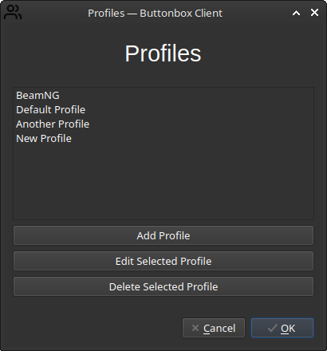
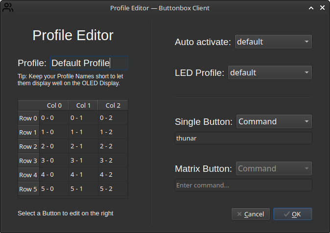

# Buttonbox

The idea behind Buttonbox is to have a Microcontroller connected to some Buttons and other hardware that can communicate with a Computer to trigger certain actions, like hitting Keyboard Combinations, changing volume and other generic or specialized tasks.

In its current form, there are 6 different components:

- An `esp32`
- 6x3 Button Matrix (using analog Ports)
- 1 Additional Push Button
- 4 LEDs
- 1 Rotary Encoder
- 1 OLED Display (128x64px)

And some additional passive components:

- 18 1N4148 Diodes
- 9 59.1 (ohm) Resistors
- 1 330 (tbc) Resistor
- 470uf 10V Capacitor
- 10uf 25V Capacitor

Wokwi project: <https://wokwi.com/projects/410915727655762945> (illustrational).

## Installing

_See: `INSTALL.md`_

## Microcontroller client

The Microcontroller client can be found at `/buttonbox/buttonbox.ino` and must be uploaded to an esp32, e.g. using Arduino IDE.
As used Pins and other hardware-specific values may vary, everything that might need configuration is marked in the `buttonbox.ino` file using an `// ADAPT` comment. Those are all located at the top of the file.

## PC client

The PC client is found at `/client` and is implemented as a PyQt6 application that runs in the background all the time (can be stopped from the GUI under `File -> Quit`). It lives in the system tray/notification area.

The client has 2 states:

- Detected
- Undetected

When undetected, it is polling the selected Serial Port for a UTF-8 encoded string with the value `HANDSHAKE`. This is sent out by the Arduino Program as soon as the Client established a Serial Connection. If the Handshake is received, the state will change to `Detected` (see Image above).

In this state, the `esp32` will continuously report the state of all Buttons, as well as Rotation Events of the Rotary Encoder to the Client, while the Client can send Commands to control Display and LEDs connected to the ESP.

Before running, one should check the Settings Menu under `Edit` > `Settings...`. Especially the Baudrate should be changed, if the Microcontroller is using a different one.

To check the functionality of the connected hardware, the `Test Mode` can be used.

### Test Mode

> _Note: Test Mode can only be activated after a Connection has been established, and the Handshake has been received._

After activating the Test Mode in the Client's Main Window, all other action will be suspended. All Hardware events will be redirected to the Test Mode Handler and the selected Profile will be temporarily deactivated. In Test Mode, Button presses will be shown in the visualization in the lower area of the Main Window (see also the lower half of the Screenshot at the top of this section). Similarly, Rotary Encoder Events will be illustrated by moving the Dial.
The 4 LEDs are made up of the 3 adjacent circles, as well as the left one of the 2 adjacent circles. Those can be clicked with the Mouse so they light up in the UI, as well as on the actual circuit. Moving the Dial manually has no effect.

> For an Image showcasing Test Mode, see [here](./screenshots/client_test.png).

### Profiles

To configure the Box' behavior, Profiles can be created. Profiles can control the following things:

- Automatic Detection: A Profile can be automatically activated, for example, when a certain game is running on a system, when a command was issued, or when any other Event took place.
- LED Management: A Profile can be assigned an LED Manager that is responsible for controlling the Diodes.
- Button Actions: Profiles allow for configuring every single Button.

Note that Automatic Detection and LED Management is currently only possible using pre-made functions.

_Profiles Dialog opened using `Edit` > `Profiles...`_

#### Configuring Profiles

In the Profile Editor, the following 4 things can be customized:

- Auto Activation: Select an Auto Activation Profile for your Buttonbox Profile. `Off` means there is no Auto Activation. `default` means, that the Profile will activate if there is no other Profile that wants to activate itself. It can be used to bind some generic commands to the Buttons, for example, to open certain Applications.
- LED Profile: Select an LED Manager. `Off` means, the LEDs are turned off all the time. `default` means, they are turned on all the time.
- Single Button: Select between 3 modes for the Button: `Off` means the Button does nothing. `Command` lets you enter a Command that will be executed like through a Shell. This can be used to launch Applications, for example, put `firefox` as Command and it will launch a Firefox Window. Third, there is `Game Action`. See the Section `Games` below for more informations.
- Button Matrix: To configure a Button from the Button Matrix, a Button has to be selected in the Table on the lower left. That will enable the `Matrix Button:` input fields. They work the same as `Single Button`.

#### Games

To implement Actions, Games are used. A Game is a collection of Actions that belong together, for example, to control a Game running on the Computer. A Game can also have Auto Detection functionality, as well as an LED Manager. That's why, Game names can be found to select in those Menus.
A Game's Action can be selected for a Button by setting the Button Type to `Game Action` and selecting the desired Action in the new Dropdown. Custom Actions can be added as well, but more on that in a later Section.

### Keyboard Shortcuts

Many Games and other Software are best controlled using Keyboard Shortcuts. These, however, may vary, depending on personal Preference, Version and even Platform. That's why it's possible to configure custom Shortcuts for certain actions, that make use of Keyboard Shortcuts. To do this, open the Shortcut Editor at `Edit` > `Keyboard Shortcuts...`. The Interface is very straightforward, click on the field next to the Action and enter a Key Combination.

If an Action is not displayed in the Shortcuts Editor, it means that the Action does not make use of Keyboard Shortcuts.

> For an Image showcasing the Shortcuts Editor, see [here](./screenshots/client_shortcuts.png).

### Custom Actions

Issuing plain Keyboard Shortcuts isn't exactly a big deal, which is why, in it's most basic form, they do not need to be implemented via code but can be freely added by the User.

> _Note: Actions defined in Code may have more advanced Behavior, like Delays and advanced Macro functionality. This is currently not possible when defining Custom Actions._

Custom Actions can be added in the Custom Actions Manager under `Edit` > `Manage Custom Actions...`. This Dialog only allows for creating new Actions, as well as deleting them. After creating an Action, go to the Shortcuts Editor at `Edit` > `Keyboard Shortcuts...` and set the Key Combination for your newly created Custom Action.

> For an Image showcasing the Custom Actions Manger, see [here](./screenshots/client_custom_actions.png).
